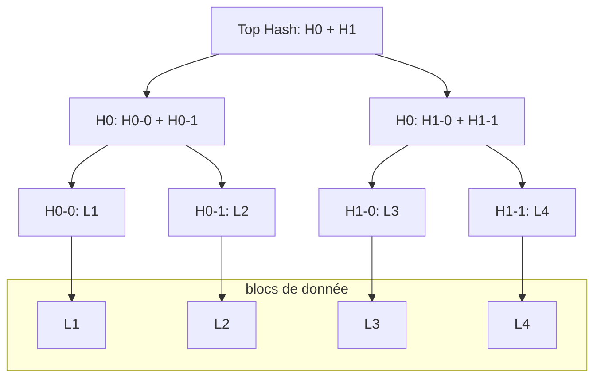

# Arbre de Merkle

#datastructures #cryptographie

- vérifier l'intégrité d'un ensemble ou d'un sous-ensemble de données
- structure de données au cœur du fonctionnement de la [[202103111719-blockchain|blockchain]]

