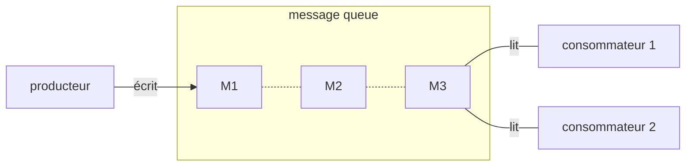

# Message queue

#algorithmique #communication #pattern

- pattern de communication via messages entre les systèmes
	- aucun système n'est isolé
	- permet l'implémentation d'une architecture [[202103041509-microservices|microservices]]
- message
	- contient donnée, métadonnée, événement ou tout à la fois
	- envoyé par une entité
	- reçu par 1,n entité(s)
- créateur du message = producteur
	- autres termes : *source*, *publisher*, *sender*
- receveur du message = consommateur
	- autres termes : *destination*, *subscriber*, *receiver*

